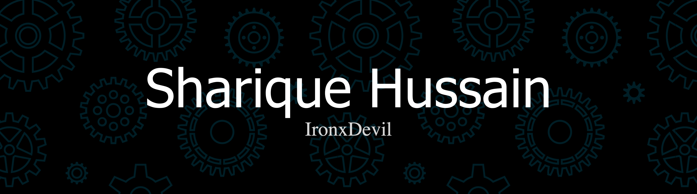

  

---

### 🚀 About Me
- 🔭 I’m currently learning **Deep Learning and Computer Vision**
- 💬 Ask me about **IoT, Robotics and AI**
- 📫 Reach me at **ironxdevil007@gmail.com**

---

### 🛠 Languages and Tools  

#### 💻 Programming Languages  

  <table>
    <tr>
      <td align="center" width="120" height="120">
         <u>Python</u>
      </td>
      <td align="center" width="120" height="120">
         <u>JavaScript</u>
      </td>
      <td align="center" width="120" height="120">
         <u>HTML5</u>
      </td>
      <td align="center" width="120" height="120">
         <u>CSS3</u>
      </td>
    </tr>
  </table>

#### ⚡ Frameworks & Libraries  

  <table>
    <tr>
      <td align="center" width="120" height="120">
         <u>React</u>
      </td>
      <td align="center" width="120" height="120">
         <u>Node.js</u>
      </td>
      <td align="center" width="120" height="120">
         <u>PyTorch</u>
      </td>
      <td align="center" width="120" height="120">
         <u>TensorFlow</u>
      </td>
    </tr>
    <tr>
      <td align="center" width="120" height="120">
         <u>OpenCV</u>
      </td>
      <td align="center" width="120" height="120">
         <u>Pandas</u>
      </td>
      <td align="center" width="120" height="120">
         <u>Scikit-learn</u>
      </td>
      <td align="center" width="120" height="120">
         <u>Seaborn</u>
      </td>
    </tr>
  </table>

#### 🔧 Hardware & IoT  

  <table>
    <tr>
      <td align="center" width="120" height="120">
         <u>Arduino</u>
      </td>
      <td align="center" width="120" height="120">
         <u>Raspberry Pi</u>
      </td>
      <td align="center" width="120" height="120">
         <u>ESP32</u>
      </td>
    </tr>
  </table>

#### 🌩 Cloud & DevOps  

  <table>
    <tr>
      <td align="center" width="120" height="120">
         <u>Google Cloud</u>
      </td>
      <td align="center" width="120" height="120">
         <u>Git</u>
      </td>
    </tr>
  </table>

#### 🎨 Design Tools  

  <table>
    <tr>
      <td align="center" width="120" height="120">
         <u>Figma</u>
      </td>
      <td align="center" width="120" height="120">
         <u>Photoshop</u>
      </td>
      <td align="center" width="120" height="120">
         <u>Framer</u>
      </td>
    </tr>
  </table>

---

<picture>
  <source
    media="(prefers-color-scheme: dark)"
    srcset="https://raw.githubusercontent.com/ankurrawatll/snk/output/github-contribution-grid-snake-dark.svg"
  />
  <source
    media="(prefers-color-scheme: light)"
    srcset="https://raw.githubusercontent.com/ankurrawatll/snk/output/github-contribution-grid-snake.svg"
  />
  
</picture>

---

### 📊 GitHub Stats  

  
  

